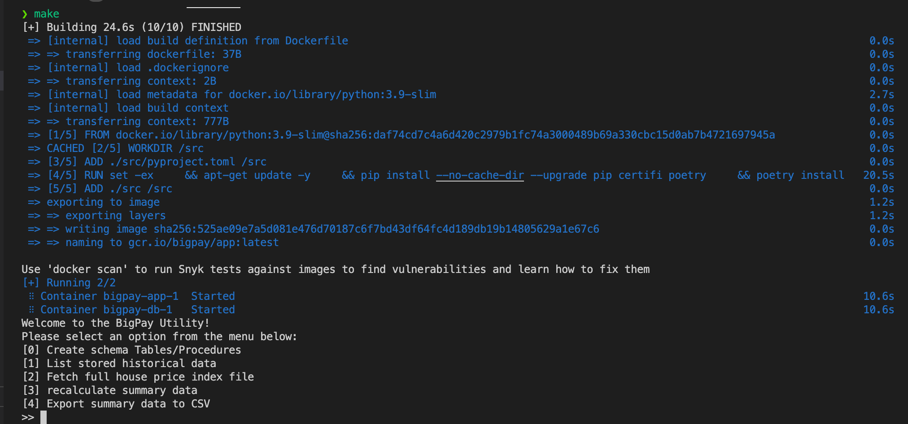
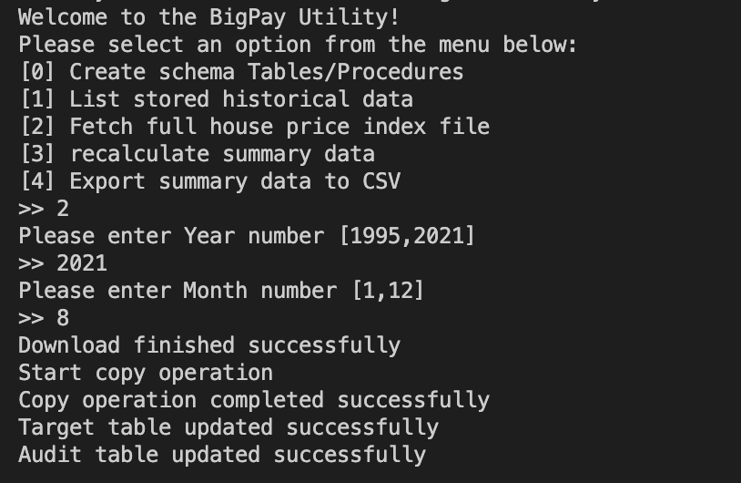
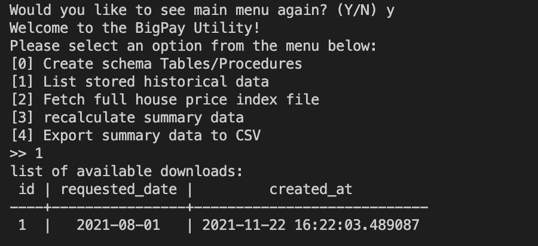

# UK house price index reports Utility

The project tends to be as simple as possible, to start there is make file in root directory with couple of options.
you may start executing them with the following order
(or simply just run `make` in root directory)

```bash
# Usage:
# make build    # build app docker image
# make start    # start and run app docker compose
# make run      # ssh into docker container and run app
# make db       # ssh into docker container and connect to db
# make test     # run unittest
# make stop     # switch off docker compose
```



Once you see the welcome message, you can start exploring the project, for the first run, you will need to create schema table/Procedures (option [0]).

then you may proceed to the next steps



